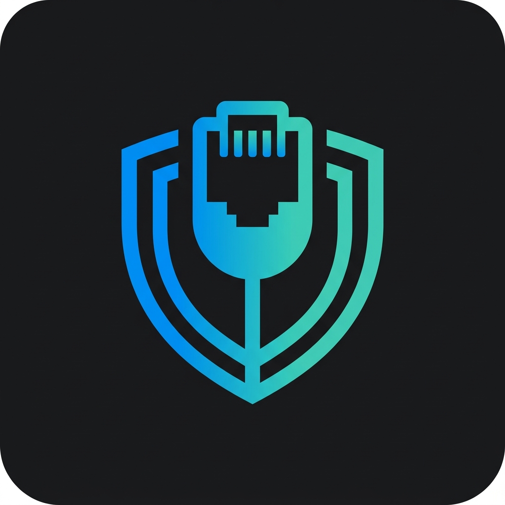

<p align="center">
  
</p>

<h1 align="center">Portman</h1>

<p align="center">
  <strong>The visual port manager for VS Code.</strong><br/>
  Detect, kill, and manage local network ports — without leaving your editor.
</p>

<p align="center">
  
  
  
  
</p>

---

## Why Portman?

Every developer has been there — you run `npm start` and get hit with:

```
Error: listen EADDRINUSE: address already in use :::3000
```

Then you're alt-tabbing to a terminal, running `lsof -i :3000`, finding the PID, killing it, and hoping you got the right process. **Portman eliminates all of that.**

It lives in your VS Code sidebar, automatically detects every port on your machine, identifies the framework behind each one, and lets you kill, switch, or copy ports with a single click.

---

## 🚀 What's New in v1.1.0

- **Workspace Grouping:** Ports are now grouped by project folder in multi-root workspaces.
- **Auto-Cleanup:** Say goodbye to zombie processes. Portman prompts to release dev ports when you close a workspace.
- **Terminal Interception:** Automatically intercepts `EADDRINUSE` errors in the terminal with a 1-click "Kill & Retry".
- **Docker & .env Support:** Identifies Docker containers and highlights expected ports from `.env` files.
- **Team Configs:** Export profiles to `.devcontainer/portman.json` to share configurations across your team.

---

## ✨ Features

### 🎴 Card-Style Port Dashboard

Dev ports are displayed as **rich, interactive cards** in the sidebar — not a boring list. Each card shows:

- **Status dot** — green (healthy), red (conflict), purple (Docker)
- **Port number** and **framework label** (Next.js, Vite, Express, Django, etc.)
- **Process info** with PID and uptime
- **Badges** — Docker container name, `.env` variable, memory usage
- **Inline actions** — Kill and Copy buttons right on the card

System and IDE ports are tucked away in collapsed sections at the bottom.

### 🔍 Smart Framework Detection

Portman identifies **40+ frameworks** from the process command string — accurately, never guessing from port numbers:

| Category | Frameworks |
|----------|-----------|
| **JavaScript** | Next.js, Nuxt, Remix, Gatsby, Astro, SvelteKit, Vite, CRA, Angular, Webpack, Parcel, Turbopack, Electron |
| **Node.js** | Express, Fastify, NestJS, Hono |
| **Python** | FastAPI (Uvicorn), Gunicorn, Flask, Django, Streamlit |
| **Ruby** | Rails, Puma |
| **Java** | Spring Boot, Tomcat, Gradle |
| **Go** | `go run` |
| **Rust** | Cargo |
| **PHP** | Laravel, PHP Built-in Server |
| **Databases** | PostgreSQL, MySQL, MongoDB, Redis |
| **Infra** | Docker, Nginx |

> Custom mappings can be added via `portman.frameworkMappings` in settings.

### ⚡ Kill & Retry

When Portman detects an `EADDRINUSE` error in your terminal, it shows a notification with three options:

- **Kill & Retry** — Kills the blocking process and re-runs your last command
- **Kill Only** — Just frees the port
- **Find Alternative** — Suggests the next available port

### 📋 Port Detail Panel

Click any dev port card to open a **full detail webview** showing:

- Large port header with process subtitle and uptime
- Action buttons: Kill process, Switch to free port, Copy URL
- Stats grid: Protocol, Status, Memory, Conflicts
- Free nearby ports as clickable chips
- Monospace activity log with timestamped events

### 🐳 Docker Container Detection

If Docker is running, Portman automatically identifies which ports are forwarded from containers and displays the **container name** alongside the port.

### 📂 `.env` File Awareness

Portman scans your workspace `.env` files for port variables (`PORT`, `DATABASE_PORT`, `API_PORT`, etc.) and shows a **[.env: PORT]** badge when an active port matches.

Supported files: `.env`, `.env.local`, `.env.development`, `.env.production`, `.env.test`

### 👥 Team Config (devcontainer)

Share port profiles with your team via `.devcontainer/portman.json`:

```json
{
  "profiles": [
    {
      "name": "Full Stack",
      "ports": [3000, 5432, 6379],
      "description": "Next.js + Postgres + Redis"
    }
  ],
  "defaultProfile": "Full Stack"
}
```

Auto-imported on workspace open when `portman.useTeamConfig` is enabled.

### 🛡️ Safety First

System processes (svchost, lsass, System, etc.) are:
- **Visually separated** — collapsed in a "System" section at the bottom
- **Kill-protected** — no inline kill button, safety modal for low-PID processes
- **Clearly labeled** — grey dots and muted styling

---

## 📦 Installation

### From Source (Development)

```bash
git clone <repo-url>
cd portman
npm install
npm run build:prod
```

Then press **F5** in VS Code to launch the Extension Development Host.

### From VSIX (Production)

```bash
npx @vscode/vsce package
code --install-extension portman-1.0.0.vsix
```

---

## ⚙️ Settings

| Setting | Default | Description |
|---------|---------|-------------|
| `portman.refreshInterval` | `5000` | Polling interval in ms (500–60000) |
| `portman.autoCleanup` | `true` | Prompt to release dev ports on workspace close |
| `portman.conflictPrediction` | `true` | Warn before launching tasks on occupied ports |
| `portman.terminalInterception` | `true` | Detect EADDRINUSE errors in the terminal |
| `portman.useTeamConfig` | `false` | Auto-import profiles from `.devcontainer/portman.json` |
| `portman.frameworkMappings` | `[]` | Custom CLI pattern → framework label mappings |
| `portman.enableTelemetry` | `false` | Opt in to anonymous local usage metrics |

---

## 🎮 Commands

All commands are available via the **Command Palette** (`Ctrl+Shift+P` / `Cmd+Shift+P`):

| Command | Description |
|---------|-------------|
| `Portman: Refresh Port List` | Force a port rescan |
| `Portman: Kill Port...` | Kill a port by number |
| `Portman: Find Free Port From...` | Find the next available port from a base |
| `Portman: Show Kill History` | Open the kill audit trail |
| `Portman: Create Port Profile` | Save a named set of ports |
| `Portman: Activate Port Profile` | Activate a saved profile |
| `Portman: Annotate Port...` | Add a custom label to a port |
| `Portman: Export to .devcontainer` | Export profiles for team sharing |
| `Portman: Import from .devcontainer` | Import team profiles |

---

## 🏗️ Architecture

```
src/
├── commands/
│   └── commandRegistry.ts      # Command Palette commands
├── data/
│   ├── portScanner.ts           # OS port scanning (netstat/lsof/ss)
│   ├── processMapper.ts         # PID → process info enrichment
│   ├── terminalWatcher.ts       # EADDRINUSE crash detection
│   ├── envScanner.ts            # .env file port parsing
│   └── dockerDetector.ts        # Docker container port mapping
├── logic/
│   ├── killOrchestrator.ts      # Safe process termination
│   ├── conflictDetector.ts      # Pre-task conflict prediction
│   ├── frameworkDetector.ts     # CLI → framework label matching
│   ├── profileManager.ts        # Port profile CRUD
│   ├── teamConfigManager.ts     # devcontainer import/export
│   └── portFinder.ts            # Free port discovery
├── state/
│   ├── globalStore.ts           # Persistent annotations
│   ├── sessionHistory.ts        # In-memory kill audit trail
│   ├── activityTracker.ts       # Per-port event log
│   └── workspaceStore.ts        # Multi-root workspace mapping
├── ui/
│   ├── portWebviewProvider.ts   # Sidebar webview (card layout)
│   ├── portDetailPanel.ts       # Detail webview panel
│   ├── statusBarController.ts   # Status bar indicator
│   └── notificationService.ts   # Notification management
├── constants.ts                 # Shared config & patterns
├── types.ts                     # TypeScript interfaces
└── extension.ts                 # Entry point & orchestration
```

**Four-layer architecture:**
1. **Data Acquisition** — Platform-specific port scanning and process enrichment
2. **Business Logic** — Kill safety, conflict prediction, framework detection
3. **State Management** — Annotations, profiles, activity logs
4. **Presentation** — Webview sidebar, detail panel, status bar

---

## 🖥️ Platform Support

| Feature | Windows | macOS | Linux |
|---------|---------|-------|-------|
| Port scanning | `netstat -ano` | `lsof -iTCP -sTCP:LISTEN` | `lsof` → `ss -tlnp` fallback |
| Process mapping | `tasklist` + `wmic` | `ps -o pid,ppid,rss,comm,args` | `ps` |
| Process kill | `tree-kill` (SIGTERM) | `tree-kill` (SIGTERM) | `tree-kill` (SIGTERM) |
| Docker detection | ✅ | ✅ | ✅ |
| Memory tracking | ✅ | ✅ | ✅ |

---

## 📄 License

MIT

---

<p align="center">
  Built with ⚡ by developers, for developers.
</p>
